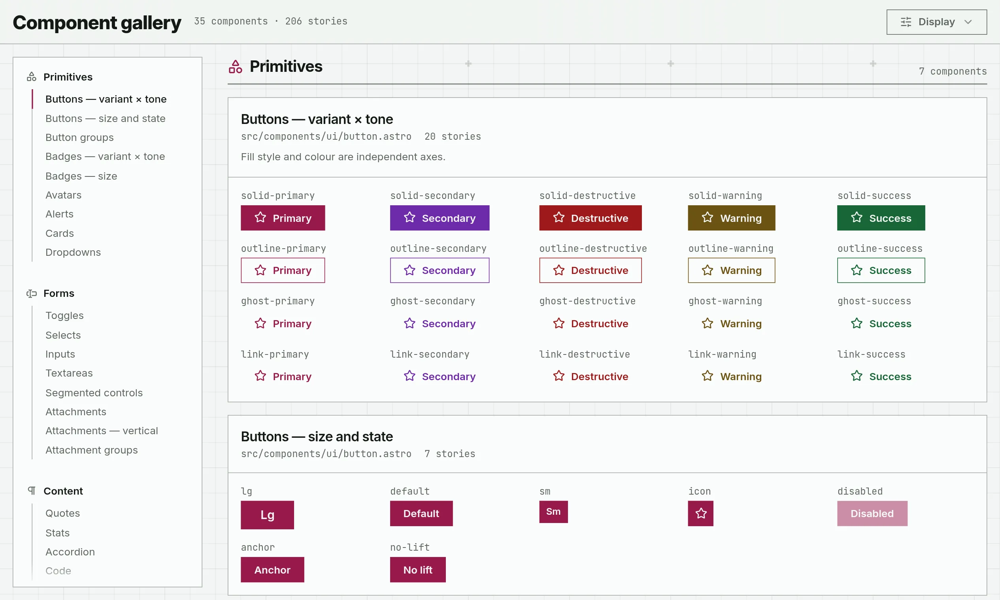

<div align="center">

# website

Source code for my website, and the components it's built from.

[](https://github.com/CPlusPatch/website/actions/workflows/ci.yml)
[](LICENSE)
[](https://astro.build)
[](https://deno.com)

**[Open the gallery](https://test.cpluspatch.com/gallery/)** · [Docs](docs/) · [License](LICENSE)

<picture>
  <source media="(prefers-color-scheme: dark)" srcset="docs/assets/gallery-dark.webp">
  
</picture>

</div>

## About

There's no real content on the site yet, so for now it's mostly a component library. Every component is in the [gallery](https://test.cpluspatch.com/gallery/), where you can try it in different themes, screen sizes and colour schemes.

Some things it has:

- Plain HTML and CSS, with JavaScript only where a component really needs it
- Everything still works with JavaScript turned off
- A bunch of colour themes, each with a light and dark mode
- A few toys, like a gravity gun that lets you throw parts of the page around

## Running it locally

You'll need [Deno](https://deno.com) 2.

```sh
deno install
deno run dev
```

The dev server runs on http://localhost:4321. Other scripts:

```sh
deno run build      # build to dist/
deno run preview    # serve the build
deno run check      # lint, typecheck and tests (same as CI)
deno run lint:fix   # format and autofix
deno run theme      # regenerate the theme colours
```

## Layout

```
website/
├── src/
│   ├── components/
│   │   ├── ui/         buttons, inputs, badges, etc.
│   │   ├── blocks/     larger components (messages, carousel, ...)
│   │   ├── sections/   navbar, footer, sidebar
│   │   ├── page/       the front page's sections
│   │   └── effects/    page-wide effects like the crosshair
│   ├── gallery/        the gallery and its stories
│   └── styles/         tokens, themes and global CSS
├── packages/
│   ├── palette/        theme colour generator
│   ├── destructor/     the gravity gun
│   └── flipbook/       turns a video into text-art frames
└── docs/               guides, linked below
```

## Docs

- [Development workflow](docs/workflow.md)
- [Design philosophy](docs/philosophy.md)
- [Adding a component](docs/components.md)
- [Themes and colours](docs/themes.md)

## License

Licensed under the [GNU AGPL v3](LICENSE).
